# Musical Ensembles Management System (MEMS)
## UML Class Diagram

```mermaid
classDiagram
    %% Domain Classes
    class Musician {
        -String musicianID
        -String mName
        -int role
        +Musician(String mID)
        +Musician(Musician other)
        +String getMID()
        +String getName()
        +int getRole()
        +void setName(String mName)
        +void setRole(int role)
        +boolean equals(Object obj)
        +int hashCode()
        +String toString()
    }

    class Ensemble {
        <<abstract>>
        -String ensembleID
        -String eName
        -List~Musician~ musicians
        +Ensemble(String eID)
        +String getEnsembleID()
        +String getName()
        +void setName(String eName)
        +void addMusician(Musician m)
        +void dropMusician(Musician m)
        +Iterator~Musician~ getMusicians()
        +EnsembleMemento createMemento()
        +void restoreFromMemento(EnsembleMemento memento)
        +updateMusicianRole(Musician m, int role)* void
        +showEnsemble()* void
    }

    class OrchestraEnsemble {
        -int VIOLINIST_ROLE = 1
        -int CELLIST_ROLE = 2
        +OrchestraEnsemble(String eID)
        +void updateMusicianRole(Musician m, int role)
        +void showEnsemble()
    }

    class JazzBandEnsemble {
        -int PIANIST_ROLE = 1
        -int SAXOPHONIST_ROLE = 2
        -int DRUMMER_ROLE = 3
        +JazzBandEnsemble(String eID)
        +void updateMusicianRole(Musician m, int role)
        +void showEnsemble()
    }

    class EnsembleMemento {
        -List~Musician~ musicians
        -String name
        +EnsembleMemento(List musicians, String name)
        +List~Musician~ getMusicians()
        +String getName()
    }

    %% Factory Pattern
    class EnsembleFactory {
        <<interface>>
        +Ensemble createEnsemble(String eID)
        +String getEnsembleType()
    }

    class OrchestraEnsembleFactory {
        +Ensemble createEnsemble(String eID)
        +String getEnsembleType()
    }

    class JazzBandEnsembleFactory {
        +Ensemble createEnsemble(String eID)
        +String getEnsembleType()
    }

    class MusicianFactory {
        <<interface>>
        +Musician createMusician(String mID, String name, int role)
        +boolean isValidRole(int role)
        +String getRoleName(int role)
    }

    class OrchestraMusicianFactory {
        -int VIOLINIST_ROLE = 1
        -int CELLIST_ROLE = 2
        +Musician createMusician(String mID, String name, int role)
        +boolean isValidRole(int role)
        +String getRoleName(int role)
    }

    class JazzBandMusicianFactory {
        -int PIANIST_ROLE = 1
        -int SAXOPHONIST_ROLE = 2
        -int DRUMMER_ROLE = 3
        +Musician createMusician(String mID, String name, int role)
        +boolean isValidRole(int role)
        +String getRoleName(int role)
    }

    class FactoryRegistry {
        -Map~String,EnsembleFactory~ ensembleFactories
        -Map~String,MusicianFactory~ musicianFactories
        -Map~String,CommandFactory~ commandFactories
        +FactoryRegistry()
        +void registerEnsembleFactory(String type, EnsembleFactory factory)
        +void registerMusicianFactory(String type, MusicianFactory factory)
        +void registerCommandFactory(String commandType, CommandFactory factory)
        +EnsembleFactory getEnsembleFactory(String type)
        +MusicianFactory getMusicianFactory(String type)
        +CommandFactory getCommandFactory(String commandType)
    }

    %% Command Pattern
    class Command {
        <<interface>>
        +boolean execute()
        +boolean undo()
        +String getDescription()
    }

    class CreateEnsembleCommand {
        -EnsembleFactory factory
        -String ensembleId
        -String name
        -EnsembleRegistry registry
        -CurrentEnsembleContext context
        -Ensemble ensemble
        -String previousEnsembleId
        -String ensembleType
        +boolean execute()
        +boolean undo()
        +String getDescription()
    }

    class AddMusicianCommand {
        -Musician musician
        -String ensembleId
        -EnsembleRegistry registry
        -MusicianRegistry musicianRegistry
        -EnsembleMemento memento
        -String roleName
        +boolean execute()
        +boolean undo()
        +String getDescription()
    }

    class ModifyMusicianInstrumentCommand {
        -String musicianId
        -int newRole
        -String ensembleId
        -EnsembleRegistry registry
        -MusicianRegistry musicianRegistry
        -EnsembleMemento memento
        -String roleName
        +boolean execute()
        +boolean undo()
        +String getDescription()
    }

    class DeleteMusicianCommand {
        -String musicianId
        -String ensembleId
        -EnsembleRegistry registry
        -MusicianRegistry musicianRegistry
        -EnsembleMemento memento
        +boolean execute()
        +boolean undo()
        +String getDescription()
    }

    class ChangeEnsembleNameCommand {
        -String ensembleId
        -String newName
        -EnsembleRegistry registry
        -String oldName
        +boolean execute()
        +boolean undo()
        +String getDescription()
    }

    %% Registry Pattern
    class EnsembleRegistry {
        -Map~String,Ensemble~ ensembles
        +EnsembleRegistry()
        +void register(Ensemble ensemble)
        +void unregister(String ensembleId)
        +Ensemble find(String ensembleId)
        +List~Ensemble~ listAll()
        +boolean exists(String ensembleId)
    }

    class MusicianRegistry {
        -Map~String,Musician~ musicians
        +MusicianRegistry()
        +void register(Musician musician)
        +void unregister(String musicianId)
        +Musician find(String musicianId)
        +boolean exists(String musicianId)
    }

    %% Application Layer
    class HistoryManager {
        -Stack~Command~ undoStack
        -Stack~Command~ redoStack
        +HistoryManager()
        +boolean executeCommand(Command command)
        +String undo()
        +String redo()
        +List~String~ getUndoList()
        +List~String~ getRedoList()
    }

    class CurrentEnsembleContext {
        -String currentEnsembleId
        +CurrentEnsembleContext()
        +void setCurrentEnsemble(String ensembleId)
        +String getCurrentEnsembleId()
        +boolean hasCurrentEnsemble()
    }

    %% Main Application
    class MEMS {
        -EnsembleRegistry ensembleRegistry
        -MusicianRegistry musicianRegistry
        -CurrentEnsembleContext context
        -FactoryRegistry factoryRegistry
        -HistoryManager historyManager
        -Scanner scanner
        +MEMS()
        +void run()
        -void displayMenu()
        -boolean processCommand(String command)
        -void createEnsemble()
        -void setCurrentEnsemble()
        -void addMusician()
        -void modifyMusicianInstrument()
        -void deleteMusician()
        -void showEnsemble()
        -void displayAllEnsembles()
        -void changeEnsembleName()
        -void undo()
        -void redo()
        -void listUndoRedo()
        +void main(String[] args)$
    }

    %% Relationships
    Ensemble <|-- OrchestraEnsemble : extends
    Ensemble <|-- JazzBandEnsemble : extends
    Ensemble o-- Musician : contains
    Ensemble ..> EnsembleMemento : creates

    EnsembleFactory <|.. OrchestraEnsembleFactory : implements
    EnsembleFactory <|.. JazzBandEnsembleFactory : implements
    
    MusicianFactory <|.. OrchestraMusicianFactory : implements
    MusicianFactory <|.. JazzBandMusicianFactory : implements

    Command <|.. CreateEnsembleCommand : implements
    Command <|.. AddMusicianCommand : implements
    Command <|.. ModifyMusicianInstrumentCommand : implements
    Command <|.. DeleteMusicianCommand : implements
    Command <|.. ChangeEnsembleNameCommand : implements

    HistoryManager o-- Command : manages
    
    MEMS --> EnsembleRegistry : uses
    MEMS --> MusicianRegistry : uses
    MEMS --> CurrentEnsembleContext : uses
    MEMS --> FactoryRegistry : uses
    MEMS --> HistoryManager : uses

    FactoryRegistry --> EnsembleFactory : manages
    FactoryRegistry --> MusicianFactory : manages
```

## Design Patterns Used

### 1. **Command Pattern**
- **Purpose**: Encapsulates operations as objects to support undo/redo functionality
- **Classes**: `Command` interface, `CreateEnsembleCommand`, `AddMusicianCommand`, `ModifyMusicianInstrumentCommand`, `DeleteMusicianCommand`, `ChangeEnsembleNameCommand`
- **Benefit**: Enables complete undo/redo history with state preservation

### 2. **Memento Pattern**
- **Purpose**: Captures and restores object state without violating encapsulation
- **Classes**: `EnsembleMemento`, `Ensemble`
- **Benefit**: Allows commands to save and restore ensemble state for undo operations

### 3. **Factory Pattern**
- **Purpose**: Provides an interface for creating objects without specifying exact classes
- **Classes**: `EnsembleFactory`, `MusicianFactory`, `OrchestraEnsembleFactory`, `JazzBandEnsembleFactory`, `OrchestraMusicianFactory`, `JazzBandMusicianFactory`
- **Benefit**: Supports Open-Closed Principle - easy to add new ensemble types

### 4. **Registry Pattern**
- **Purpose**: Centralized storage and lookup for domain objects
- **Classes**: `EnsembleRegistry`, `MusicianRegistry`, `FactoryRegistry`
- **Benefit**: Single source of truth for object management

### 5. **Template Method Pattern**
- **Purpose**: Defines skeleton of algorithm in base class, letting subclasses override specific steps
- **Classes**: `Ensemble` (abstract), `OrchestraEnsemble`, `JazzBandEnsemble`
- **Benefit**: Common ensemble behavior with type-specific implementations

## Key Architectural Features

- **Separation of Concerns**: Clear separation between domain, factory, command, registry, and application layers
- **Extensibility**: New ensemble types can be added without modifying existing code
- **Maintainability**: Each class has a single, well-defined responsibility
- **Testability**: Loose coupling between components enables easy unit testing
- **State Management**: Robust undo/redo with complete state preservation
